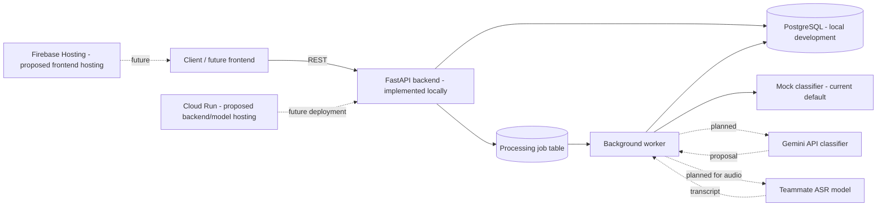

# Code for Communities Hackathon Submission

Use this page as the written submission companion to the pitch deck. It describes the project as it exists today and separates implemented components from planned integrations.

## 1. Theme alignment

**Track: Innovation**

AI for Digital Public Infrastructure & Governance explores an AI-supported way for people to report local infrastructure concerns in their own languages and for public-service teams to review those reports in one workflow. The current backend prototype accepts text and audio submissions, stores feedback and processing state, and exposes citizen, staff-review, and aggregate analytics APIs. Classification currently uses a mock provider by default; ASR and Gemini are planned integrations, not live features. Human staff remain responsible for decisions, and raw submission counts are not funding recommendations.

## 2. Public code repository

**Repository:** [AI for Digital Public Infrastructure & Governance](https://github.com/SauravKumar2015/AI-for-Digital-Public-Infrastructure-Governance)

The repository contains the FastAPI backend, database migrations, API testing guide, architecture, requirements, and project documentation. It currently does not contain a frontend or model weights. Setup instructions are in the root README.

## 3. Architecture overview

### Implemented now

- FastAPI application with versioned REST routes.
- PostgreSQL schema and Alembic migrations.
- Database-backed worker for processing queued submissions.
- Mock text classifier by default, with a configurable HTTP NLP adapter.
- Local development identity and local audio-file storage.

### Planned or not connected yet

- Gemini API classification/reasoning.
- Teammate's ASR model and transcript flow.
- Production deployment on Google Cloud.
- Hosted PostgreSQL, private object storage, and production identity provider.
- Frontend.

**Proposed Google Cloud deployment:** Firebase Hosting can serve a future static frontend; Cloud Run can host the FastAPI API and, subject to GPU and billing requirements, the teammate's model service; Cloud SQL can host PostgreSQL. Gemini would be called by the backend using a server-side secret. These are proposed architecture choices; they are not deployed by this repository today.

## 4. Pitch deck

Submit the accompanying pitch deck as PDF if the hackathon form accepts a file upload. Keep the editable PPTX as the source and keep this Markdown page in the public repository.

### Suggested demo statement

The current demonstrable scope is a backend/API prototype. The API can receive feedback, return a receipt, expose staff review routes, and return aggregate report counts. Text classification is a mock by default; audio transcription, Gemini integration, and the frontend are not yet connected. Demonstrate with non-sensitive sample data through Swagger at `/docs` while a local API is running, or include a live URL only after checking the deployed service yourself.

## Final submission checklist

- Select Innovation in the submission form and paste the theme-alignment paragraph above.
- Confirm the GitHub repository is public and the latest README and submission guide are pushed.
- Include the architecture overview, with current and planned components labeled.
- Upload the pitch deck PDF if supported; provide the repository link in the form.
- Describe only features you can demonstrate. Do not claim ASR, Gemini, or a frontend is live until it works end to end.
- Use synthetic or non-sensitive recordings for a public demo.
- Verify any live URL from a second browser/device and make sure it does not expose development credentials or data.
